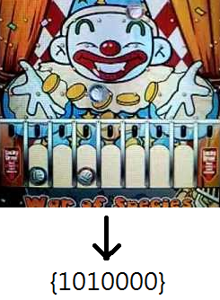
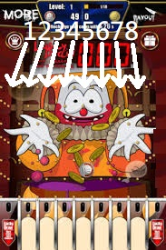

# clown-coin-machine-simulation with AI
## This is the clown coin machine 

[x] Reward calculation

[ ] AI improvement

[ ] collision simulation

[ ] physical bias factor

## Find the correponds state

## Look in solution (current best solution: sheet solution 3)

Solution for {1010000} : 6

*Note that 9 is just claim reward which is the only case with all coins filled

## Try to put coin in the corrsponds position

## AI could be improve in the future to find best solution including defraction

# License
## clown-coin-machine-simulation is licensed under the MIT License. The full license text is available in LICENSE.
