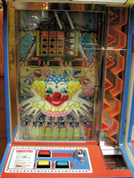

# clown-coin-machine-simulation with AI
This is the clown coin machine 

Find the correponds state

Look in solution (current best solution:solution 3)

Solution for {1010000} : 6

Try to put coin in the corrsponds position

position 6

AI could be improve in the future to find best solution including defraction
